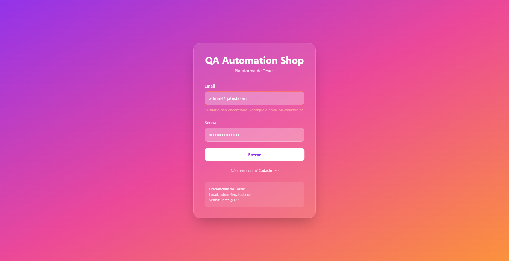

# 🔄 Reteste — BUG-001

## 1. Identificação

| Campo | Informação |
|---|---|
| Bug | BUG-001 |
| Caso de teste | CT-LOGIN-002 |
| Funcionalidade | Login |
| Status do reteste | PASSOU |
| Status do bug | Corrigido |

## 2. Objetivo

Validar se a correção aplicada ao BUG-001 resolveu o problema identificado no tratamento de senhas inválidas.

## 3. Cenário retestado

### Dados utilizados

- Email: `admin@qatest.com`
- Senha: `SenhaIncorreta123`

### Passos

1. Acessar a tela de login.
2. Informar o e-mail do usuário cadastrado.
3. Informar uma senha incorreta.
4. Clicar em **Entrar**.

## 4. Resultado esperado

O sistema deve impedir o acesso e apresentar a mensagem:

`Email ou senha inválidos`

## 5. Resultado obtido

O sistema impediu o acesso e apresentou a mensagem:

`Email ou senha inválidos`

## 6. Resultado do reteste

**PASSOU** ✅

O comportamento observado está de acordo com o resultado esperado para o cenário.

## 7. Evidência

## 8. Conclusão

Após o reteste, confirmou-se que o comportamento reportado no BUG-001 não foi mais reproduzido.

O sistema passou a exibir uma mensagem compatível com o cenário de senha inválida.

**BUG-001: Corrigido.**
